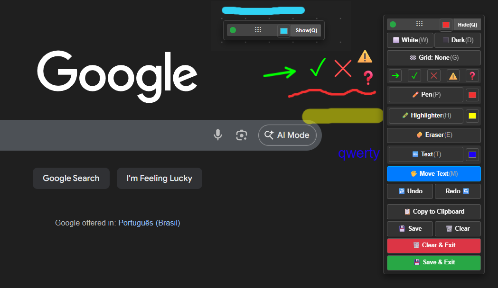

# 🖊️ Privacy Draw Toolkit

A lightweight browser extension that lets you draw, annotate, and add text on top of any webpage — great for presentations, tutorials, privacy-conscious screenshots, and quick visual notes.

---

## ✨ Features

- ✏️ **Pen tool** — freehand drawing with adjustable size and color
- 🟡 **Highlighter** — semi-transparent highlight over any content
- ⌨️ **Text tool** — click anywhere on the page to type
- 🔣 **Symbol stamps** — quickly place visual markers
- 🧹 **Eraser** — remove parts of your drawing
- ↩️ **Undo / Redo** — full stroke history
- ⬜ **Whiteboard / Darkboard mode** — solid background for clean presentations
- 📐 **Grid overlay** — toggleable grid for alignment
- 🔲 **Minimizable toolbar** — stays out of your way when not needed
- 🔴 **Laser pointer** — temporary glowing dot for live presentations
- 🖼️ **Full-page screenshot** — capture the page with annotations via Copy or Save
- ⚠️ **Leave-page warning** — prompts before closing if you have unsaved work

---

## 📦 Installation (Manual)

1. Download or clone this repository
2. Open Chrome and go to `chrome://extensions`
3. Enable **Developer Mode** (toggle in the top-right corner)
4. Click **"Load unpacked"** and select the project folder
5. Click the extension icon in your toolbar to activate it on any page

---

## ⌨️ Keyboard Shortcuts

| Key | Action |
|-----|--------|
| `P` | Pen tool |
| `E` | Eraser |
| `H` | Highlighter |
| `T` | Text tool |
| `G` | Symbol stamp |
| `W` | Whiteboard / Darkboard |
| `L` | Laser pointer |
| `Q` | Hide / show toolbar |
| `Ctrl+Z` | Undo |
| `Ctrl+Y` | Redo |
| `Esc` | Toggle browsing mode (suspends all tools) |

> While in **browsing mode**, all shortcuts are disabled except `Q` and `Esc` to reactivate.

---

## 🚀 For the future (maybe)

*UI, Qol improvements 
*lines, circles   
*make the toolbox remember its last position so it opens in the same spot next time  
*small opacity slider for the Whiteboard/Darkboard backgrounds

---

## 🛠️ How It Works

Clicking the extension icon injects a full-screen canvas overlay and a floating toolbar into the current tab. Clicking the icon again prompts you to close the toolkit and removes all injected elements cleanly from the page.

---

## 📋 Changelog

### v2.2 — 2026-04-11

Pen cursor — replaced generic cursor with a custom SVG pen icon; line now draws from the exact tip of the cursor

Drawing accuracy — fixed coordinate offset so strokes align precisely with the cursor position at any zoom level or display scale

Pen size preview — a dot showing the current brush size now appears only while scrolling to resize, then disappears when drawing starts

### v2.1 — 2026-04-09

✏️ Pen Tool

The pen now shows a custom pen-shaped cursor instead of the default system arrow

The color dot indicator is still visible alongside the pen icon, showing current brush size and color

🔤 Text Tool

A visible dashed box now appears when placing text, so you can see exactly where it will land before clicking

Pressing Esc while on the Text tool now switches back to the Pen tool instead of exiting drawing mode entirely

### v2.0 — 2026-03-30

**New Features**
- 🔴 Added **Laser Pointer** tool (`L` shortcut) with red glowing dot and hidden cursor while active
- 🖼️ Added **full viewport screenshot** via `captureVisibleTab` in `background.js` — Copy and Save now capture the full visible page with annotations
- 💾 Added **persistent color and size preferences** via `chrome.storage.sync`
- 🔲 Added **faded minimized toolbar** — opacity 0.4 when hidden, restores on hover
- 🚶 Added **browsing mode** as a first-class state — press `Esc` to suspend all tools; only `Q` and `Esc` remain active while browsing

**UI Changes**
- Replaced bottom action buttons with streamlined: Copy to Clipboard, 💾 Save, 🧹 Clear, ✖ Exit
- Removed all `confirm()` popup dialogs throughout the extension
- Added `"tabs"` and `"storage"` permissions to `manifest.json`
- Added icons fields to `manifest.json`

**Bug Fixes**
- Fixed scroll freeze when toolkit was inactive — wheel listener now exits early in browsing mode
- Fixed `Cannot read properties of undefined` errors on `onmousedown` and `onmousemove` after toolkit closed
- Fixed all event handlers not being properly removed on cleanup
- Fixed `beforeunload` and `wheel` listeners not being removed on cleanup
- Fixed double confirm popup on Clear & Exit button
- Fixed `setTimeout` firing after toolkit was closed — added `clearTimeout` in cleanup
- Fixed toolbar appearing in screenshots — added `requestAnimationFrame` + 100ms delay before capture

### v1.0 — Initial Release

- Core drawing tools: Pen, Highlighter, Eraser, Text, Symbol Stamps
- Undo / Redo support
- Whiteboard / Darkboard mode
- Grid overlay
- Minimizable toolbar
- Leave-page warning

---

## 📄 License

MIT License — feel free to use, modify, and distribute.

---

## 👤 Author

Made by [@Jhonatanjhs](https://github.com/Jhonatanjhs)
